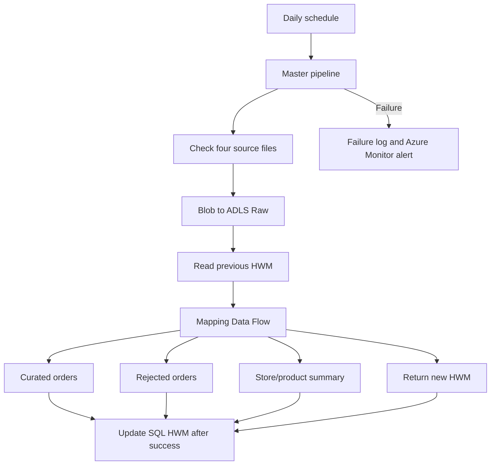
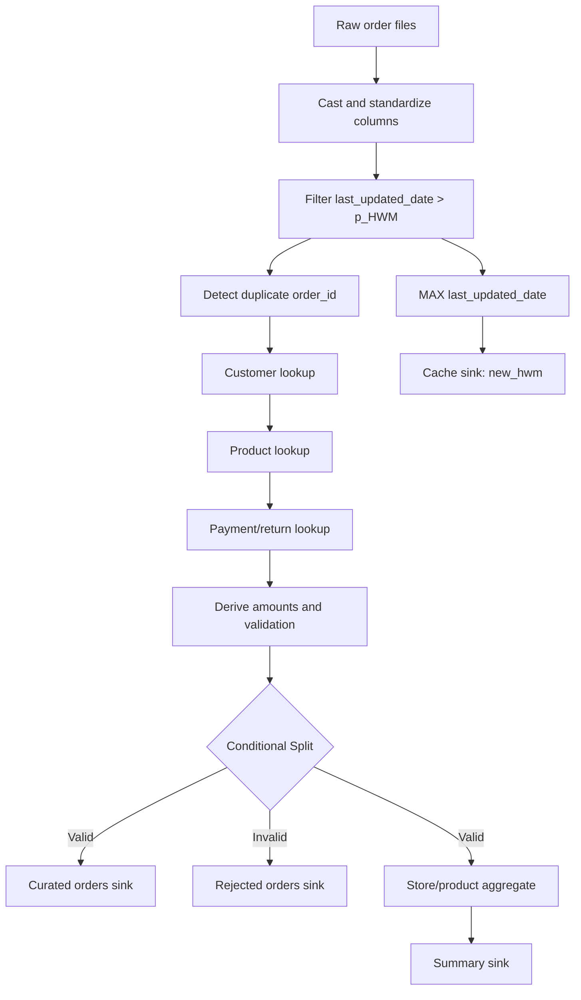

# QuickBasket Production-Style ETL & Incremental Data Pipeline

An end-to-end Azure data engineering project that uses **Azure Data Factory (ADF)**, **Azure Blob Storage**, **Azure Data Lake Storage Gen2 (ADLS)**, **Azure SQL Database**, **Mapping Data Flows**, and **GitHub integration** to ingest, validate, enrich, and publish QuickBasket order data.

The solution demonstrates production-oriented patterns including file-arrival checks, metadata-driven ingestion, dynamic routing, incremental processing with a high-water mark (HWM), data-quality rejection, business-ready curated outputs, operational logging, failure-safe control updates, and Azure Monitor alerting.

> **Project status:** completed and validated end to end. The master orchestration, file-availability checks, metadata-driven ingestion, incremental Mapping Data Flow, Curated/Rejected outputs, summary, HWM update, SQL success/failure logging, Git integration, and Azure Monitor alert design are included.

## Architecture



## Implementation screenshots

### Master orchestration and successful run

`PL_MASTER_QUICKBASKET` executes the availability/ingestion pipeline, reads the Orders HWM, and invokes `PL_02_PROCESS_ORDERS`. The captured Debug run shows all three master activities completed successfully.

### Daily file availability checks

`PL_UNTIL` uses Get Metadata activities inside an Until loop to wait for Customers, Products, Orders, and Payment/Return files before ingestion begins.

### Metadata-driven ingestion

`PL_DATA_INGESTION` prepares the file array, iterates with ForEach, and uses Switch to route each source into its corresponding ADLS Raw folder.

### Check-and-ingest control pipeline

`PL_01_CHECK_AND_INGEST` runs the Until child pipeline, invokes ingestion after availability succeeds, and explicitly fails when ingestion fails.

### Processing, HWM, and operational logging

`PL_02_PROCESS_ORDERS` executes the Mapping Data Flow. Its success path updates the HWM and writes a success log; its failure path writes the Data Flow error to the failure log.

> For strict production sequencing, connect the Success Logging activity after the HWM Stored Procedure succeeds. This prevents a success record if the Data Flow succeeds but the SQL HWM update fails.

### Mapping Data Flow — sources, enrichment, and HWM branch

The first half of `DF_PROCESS_ORDERS` reads Raw Orders, applies the HWM filter, calculates the new HWM through a constant-key aggregate, writes it to `HwmCache`, and enriches the incremental order stream with Customer, Product, and Payment/Return lookups.


### Mapping Data Flow — Curated, Rejected, and Summary outputs

The final half derives revenue and validation results, splits valid and invalid rows, publishes enriched Curated Orders, retains invalid rows in Rejected Orders, and aggregates the valid stream into the Store/Product Summary.


### End-to-end workflow

```text
Schedule → Master → Until → Get Metadata → Filter → ForEach → Switch
         → Copy to Raw → HWM Lookup → Mapping Data Flow
         → Curated / Rejected → Summary → HWM Update → Success Log
```

## Business scenario

QuickBasket receives four source files. Master data is delivered using stable filenames, while transaction files use a daily date suffix.

| Source | Purpose | Expected filename |
|---|---|---|
| Customers | Customer master | `customers.csv` |
| Products | Product master | `products.csv` |
| Orders | Order transactions | `orders_YYYYMMDD.csv` |
| Payments/returns | Payment and return details | `payments_returns_YYYYMMDD.csv` |

Source records can include duplicate orders, missing customer/product references, invalid quantities or selling prices, and late-arriving orders.

An important incremental-loading rule is:

> A new daily file does not necessarily contain only orders created that day.

For this reason, incremental processing uses `last_updated_date`, not `order_date`.

```text
Incremental filter : last_updated_date > previous HWM
New HWM            : MAX(last_updated_date)
```

## Storage layout

```text
quickbasket/
├── input/
│   ├── customers/customers.csv
│   ├── products/products.csv
│   ├── orders/orders_20260815.csv
│   └── payments_returns/payments_returns_20260815.csv
├── raw/
│   ├── customers/
│   ├── products/
│   ├── orders/
│   └── payments_returns/
├── curated/
│   ├── orders/
│   └── store_product_summary/
└── rejected/
    └── orders/
```

The Raw layer preserves source files without business transformations. Curated contains clean, enriched records and aggregated business outputs. Rejected retains invalid or duplicate orders together with their validation reason.

## ADF pipelines

### `PL_MASTER_QUICKBASKET`

The master pipeline runs from a daily Schedule Trigger and coordinates the solution in this order:

1. `PL_01_CHECK_AND_INGEST`
2. `Lookup HWM`
3. `PL_02_PROCESS_ORDERS`

The Lookup reads the previous Orders watermark from Azure SQL and passes it to the processing child pipeline. Processing begins only after ingestion succeeds. Any unhandled child-pipeline failure causes the master pipeline to fail.

```sql
SELECT last_processed_timestamp AS previous_hwm
FROM dbo.etl_watermark
WHERE source_name = 'orders';
```

`source_name = 'orders'` is a logical control key. It does not read an ADLS folder or parse a filename.

### `PL_01_CHECK_AND_INGEST`

This pipeline waits until all four expected files are available and then copies them from Blob Storage to the appropriate ADLS Raw folders.

| Activity | Responsibility |
|---|---|
| Until | Poll until all required daily files exist or the timeout is reached |
| Get Metadata | Read `exists` or `childItems` from the source locations |
| Filter | Retain required files and ignore unrelated files such as test/README files |
| ForEach | Iterate through the selected source files |
| Switch | Route customers, products, orders, and payments/returns independently |
| Copy | Move source bytes to ADLS Raw without business transformation |

Daily values are parameterized using `p_file_date` in `yyyyMMdd` format. Example:

```adf
@formatDateTime(utcNow(),'yyyyMMdd')
```

Dynamic transaction filenames can then be constructed with:

```adf
@concat('orders_', pipeline().parameters.p_file_date, '.csv')
```

```adf
@concat('payments_returns_', pipeline().parameters.p_file_date, '.csv')
```

### `PL_02_PROCESS_ORDERS`

The processing pipeline:

1. Receives the previous HWM and file/path parameters from the master pipeline.
2. Passes the HWM to `DF_PROCESS_ORDERS` as `p_HWM`.
3. Passes the processing date as `p_file_date` for dynamic input and output filenames.
4. Runs the Mapping Data Flow.
5. Reads `new_hwm` from the Data Flow Cache sink output.
6. Updates SQL only after the complete Data Flow succeeds.
7. Writes a success audit record when processing succeeds.
8. Writes a failure audit record when the Data Flow fails.

Typical parent-to-child parameter mapping:

| Child parameter | Value from master pipeline |
|---|---|
| `pl_HWM` | `@activity('Lookup HWM').output.firstRow.previous_hwm` |
| `pl_file_date` | `@formatDateTime(utcNow(),'yyyyMMdd')` or a backfill date |
| `pl_container` | `raw` |
| `pl_folder` | `orders` |

## Mapping Data Flow: `DF_PROCESS_ORDERS`



The Raw Orders source uses a wildcard so multiple Raw order files can be read as one logical stream. Previously processed rows may be scanned again, but the HWM filter removes them from the processing stream.

### Data Flow parameters

| Parameter | Type | Purpose |
|---|---|---|
| `p_HWM` | String | Previous SQL HWM passed by the pipeline |
| `p_file_date` | String | Processing date used in output filenames |

The initial SQL HWM is seeded with a deliberately old timestamp such as `1900-01-01 00:00:00.000`. This removes the need for separate first-run branching.

### Master-data preparation

Customer cleanup includes:

- trimming customer names;
- replacing null/blank cities with `UNKNOWN`;
- removing duplicate customer IDs before lookup.

Customer and product keys are renamed before lookup (for example, `master_customer_id` and `master_product_id`) to avoid ambiguous duplicate column names.

Payment/return data is brought into the Orders stream using `order_id`. A missing payment match does not invalidate an order; null `refund_amount` is defaulted to zero.

```text
iifNull(refund_amount, toDecimal(0, 10, 2))
```

### Financial calculations

```text
gross_amount      = quantity * selling_price
discounted_amount = gross_amount - discount
gst_amount        = discounted_amount * 0.18
final_amount      = discounted_amount + gst_amount
```

Values are rounded to two decimal places. `net_revenue` is calculated using the order status and refund amount:

| Order status | Processing type | Refund applicable | Net revenue rule |
|---|---|---|---|
| Delivered | `SALE` | No | `final_amount - refund_amount` |
| Returned | `RETURN` | Yes | `final_amount - refund_amount` |
| Cancelled | `CANCELLED` | No | `0` |

### Duplicate handling

A Window transformation partitions by `order_id`, sorts by `last_updated_date` descending, and creates `rank_duplicate` using `rowNumber()`.

- `rank_duplicate == 1`: retain the latest/first selected occurrence.
- `rank_duplicate > 1`: send the additional occurrence to Rejected as `DUPLICATE_ORDER`.

### Validation rules

An order is valid only when:

```text
customer exists
AND product exists
AND quantity > 0
AND selling_price > 0
AND rank_duplicate == 1
```

The Conditional Split is configured as **Match first condition** with one explicit `valid` stream and a Default `invalid` stream. A record reaches Curated only when every validation rule passes; otherwise, it reaches Rejected.

On the invalid branch, a Derived Column creates `error_reason`. Independent `iif` expressions are used so a record can retain every applicable failure reason:

```text
concat(
    iif(invalid_customer, 'INVALID_CUSTOMER; ', ''),
    iif(invalid_product_id, 'INVALID_PRODUCT; ', ''),
    iif(invalid_quantity, 'INVALID_QUANTITY; ', ''),
    iif(invalid_selling_price, 'INVALID_SELLING_PRICE; ', ''),
    iif(rank_duplicate >= 2, 'DUPLICATE_ORDER; ', '')
)
```

Example:

```text
INVALID_CUSTOMER; INVALID_QUANTITY; DUPLICATE_ORDER;
```

If the validation flags were created as strings instead of Boolean columns, compare them with `'True'` inside each `iif`.

## Outputs

### Curated Orders

Curated Orders is a denormalized, business-ready dataset containing:

- order identifiers and transaction attributes;
- customer name, city, and membership;
- product name, brand, and category;
- payment and return attributes;
- calculated financial values;
- processing type and refund applicability;
- audit timestamps.

Temporary technical columns such as `rank_duplicate`, validation flags, renamed lookup keys, and `error_reason` are removed using a Select transformation only on the Valid branch.

Example filename:

```text
curated/orders/orders_20260815.csv
```

### Rejected Orders

Rejected output preserves the original order fields and technical validation columns so issues can be investigated and replayed if necessary.

| Error reason | Meaning |
|---|---|
| `INVALID_CUSTOMER` | Customer ID is missing from the Customer master |
| `INVALID_PRODUCT` | Product ID is missing from the Product master |
| `INVALID_QUANTITY` | Quantity is zero or negative |
| `INVALID_SELLING_PRICE` | Selling price is zero or negative |
| `DUPLICATE_ORDER` | Additional occurrence of an order ID |

Example filename:

```text
rejected/orders/rejected_orders_20260815.csv
```

### Store/Product Summary

The Valid stream branches to an Aggregate grouped by store and product attributes. Measures include:

- `total_orders`
- `total_quantity`
- `total_sales`
- `total_refund`
- `net_revenue`

Example filename:

```text
curated/store_product_summary/store_product_summary_20260815.csv
```

For this small project, each CSV sink can use **Output to single file** with **Single partition** to preserve an exact dynamic filename. Distributed part files are preferable for large production volumes.

## High-water mark control

The HWM is calculated from the incremental stream immediately after the HWM Filter—not only from Valid Orders. Successfully rejected records have also been processed and must not be selected again on every run.

```text
new_hwm = max(last_updated_date)
```

Because ADF Aggregate may require a Group By expression, the HWM branch first derives a constant value:

```text
hwm_group = 1
```

It then groups by `hwm_group` and calculates `new_hwm = max(last_updated_date)`, producing one global maximum row. `HwmCache` is configured as:

```text
Sink type                : Cache
Write to activity output : Enabled
Sink group               : 1
```

The pipeline Data Flow activity uses:

```text
Logging level  : None
First row only : Enabled
```

ADF can serialize a Timestamp returned by the Cache sink as Unix epoch milliseconds. For example, `1786784400000` represents `2026-08-15 09:00:00.000 UTC`. Convert that value in the Stored Procedure activity parameter before passing it to Azure SQL:

```adf
@formatDateTime(
    addSeconds(
        '1970-01-01T00:00:00Z',
        div(
            activity('DF_PROCESS_ORDERS')
                .output.runStatus.output.HwmCache.value[0].new_hwm,
            1000
        )
    ),
    'yyyy-MM-dd HH:mm:ss.fff'
)
```

This allows the Stored Procedure parameter to remain `DATETIME2(3)` and avoids changing the SQL procedure to accept an epoch value.

The SQL update is connected using an **Upon Success** dependency. Therefore, if Curated, Rejected, Summary, or another Data Flow operation fails, SQL retains the previous HWM and the next run can retry the same incremental range.

Example control table:

```sql
CREATE TABLE dbo.etl_watermark
(
    source_name                 VARCHAR(50)  NOT NULL,
    last_processed_timestamp    DATETIME2(3) NOT NULL,

    CONSTRAINT PK_etl_watermark PRIMARY KEY (source_name)
);

INSERT INTO dbo.etl_watermark
    (source_name, last_processed_timestamp)
VALUES
    ('orders', '1900-01-01 00:00:00.000');
```

Example update procedure:

```sql
CREATE OR ALTER PROCEDURE dbo.usp_Update_Watermark
    @SourceName          VARCHAR(50),
    @NewWatermarkValue   DATETIME2(3)
AS
BEGIN
    SET NOCOUNT ON;

    UPDATE dbo.etl_watermark
    SET last_processed_timestamp = @NewWatermarkValue
    WHERE source_name = @SourceName;
END;
```

## Operational logging

The project uses two Azure SQL audit tables:

- `dbo.etl_success_log`: successful activities, factory/trigger context, source/file details, and row counts;
- `dbo.etl_failure_log`: failed activities, factory/trigger context, error code, and error message.

The same logging procedures are reusable across ingestion Copy activities and the processing Data Flow.

The complete executable SQL is available in [`sql/quickbasket_control_objects.sql`](sql/quickbasket_control_objects.sql).

### Success log table and procedure

```sql
CREATE TABLE dbo.etl_success_log
(
    success_log_id       BIGINT IDENTITY(1,1) PRIMARY KEY,
    data_factory_name    VARCHAR(200) NULL,
    trigger_id           VARCHAR(100) NULL,
    pipeline_name        VARCHAR(100) NOT NULL,
    pipeline_run_id      VARCHAR(100) NOT NULL,
    activity_name        VARCHAR(100) NOT NULL,
    source_name          VARCHAR(100) NULL,
    file_name            VARCHAR(255) NULL,
    rows_read            BIGINT NULL,
    rows_written         BIGINT NULL,
    status               VARCHAR(20) NOT NULL,
    logged_timestamp     DATETIME2(3) NOT NULL
);

CREATE OR ALTER PROCEDURE dbo.usp_Insert_Success_Log
    @PipelineName       VARCHAR(100),
    @PipelineRunId      VARCHAR(100),
    @ActivityName       VARCHAR(100),
    @SourceName         VARCHAR(100) = NULL,
    @FileName           VARCHAR(255) = NULL,
    @RowsRead           BIGINT = NULL,
    @RowsWritten        BIGINT = NULL,
    @DataFactoryName    VARCHAR(200) = NULL,
    @TriggerId          VARCHAR(100) = NULL
AS
BEGIN
    SET NOCOUNT ON;

    INSERT INTO dbo.etl_success_log
    (
        data_factory_name, trigger_id,
        pipeline_name, pipeline_run_id, activity_name, source_name,
        file_name, rows_read, rows_written, status, logged_timestamp
    )
    VALUES
    (
        @DataFactoryName, @TriggerId,
        @PipelineName, @PipelineRunId, @ActivityName, @SourceName,
        @FileName, @RowsRead, @RowsWritten, 'SUCCEEDED', SYSUTCDATETIME()
    );
END;
```

### Failure log table and procedure

```sql
CREATE TABLE dbo.etl_failure_log
(
    failure_log_id       BIGINT IDENTITY(1,1) PRIMARY KEY,
    data_factory_name    VARCHAR(200) NULL,
    trigger_id           VARCHAR(100) NULL,
    pipeline_name        VARCHAR(100) NOT NULL,
    pipeline_run_id      VARCHAR(100) NOT NULL,
    activity_name        VARCHAR(100) NOT NULL,
    source_name          VARCHAR(100) NULL,
    file_name            VARCHAR(255) NULL,
    error_code           VARCHAR(100) NULL,
    error_message        NVARCHAR(MAX) NULL,
    status               VARCHAR(20) NOT NULL,
    logged_timestamp     DATETIME2(3) NOT NULL
);

CREATE OR ALTER PROCEDURE dbo.usp_Insert_Failure_Log
    @PipelineName       VARCHAR(100),
    @PipelineRunId      VARCHAR(100),
    @ActivityName       VARCHAR(100),
    @SourceName         VARCHAR(100) = NULL,
    @FileName           VARCHAR(255) = NULL,
    @ErrorCode          VARCHAR(100) = NULL,
    @ErrorMessage       NVARCHAR(MAX) = NULL,
    @DataFactoryName    VARCHAR(200) = NULL,
    @TriggerId          VARCHAR(100) = NULL
AS
BEGIN
    SET NOCOUNT ON;

    INSERT INTO dbo.etl_failure_log
    (
        data_factory_name, trigger_id,
        pipeline_name, pipeline_run_id, activity_name, source_name,
        file_name, error_code, error_message, status, logged_timestamp
    )
    VALUES
    (
        @DataFactoryName, @TriggerId,
        @PipelineName, @PipelineRunId, @ActivityName, @SourceName,
        @FileName, @ErrorCode, @ErrorMessage, 'FAILED', SYSUTCDATETIME()
    );
END;
```

### Success dependency

```text
Activity succeeds → usp_Insert_Success_Log
```

Typical values include:

```adf
Data factory   : @pipeline().DataFactory
Trigger ID     : @pipeline().TriggerId
Pipeline name  : @pipeline().Pipeline
Pipeline run ID: @pipeline().RunId
File name      : @item().name
Rows read      : @activity('COPY_Blob_To_Raw').output.rowsRead
Rows written   : @activity('COPY_Blob_To_Raw').output.rowsCopied
```

### Failure dependency

```text
Activity fails → usp_Insert_Failure_Log → Fail activity
```

Typical values include:

```adf
Error code   : @activity('COPY_Blob_To_Raw').error.errorCode
Error message: @activity('COPY_Blob_To_Raw').error.message
```

The explicit Fail activity ensures that logging the handled error does not accidentally convert the overall pipeline result to Succeeded.

## Azure Monitor alerting

Configure an Azure Monitor alert for failed runs of `PL_MASTER_QUICKBASKET`:

1. Open **Azure Monitor → Alerts → Create → Alert rule**.
2. Select the Azure Data Factory resource as the scope.
3. Choose the **Failed pipeline runs** signal/metric.
4. Filter the pipeline name to `PL_MASTER_QUICKBASKET` when the portal exposes the pipeline-name dimension.
5. Set the alert threshold to greater than `0` over the selected evaluation window.
6. Create or select an Action Group for email, SMS, webhook, Logic App, or ITSM notification.
7. Name the rule `ALERT_QuickBasket_Master_Failure` and enable it.

Azure SQL failure logs provide technical details, while Azure Monitor provides proactive notification.

## Dynamic datasets and filenames

A reusable parameterized ADLS sink dataset can expose:

| Dataset parameter | Purpose |
|---|---|
| `p_folder_path` | Curated, rejected, or summary directory |
| `p_file_name` | Dynamically generated output filename |

The pipeline passes `p_file_date` to the Data Flow. Inside Mapping Data Flow expressions, it is referenced as `$p_file_date`:

```text
concat('orders_', $p_file_date, '.csv')
concat('rejected_orders_', $p_file_date, '.csv')
concat('store_product_summary_', $p_file_date, '.csv')
```

Using the logical processing date instead of `utcNow()` inside the sinks keeps backfills and reruns correctly named.

### Generic ADLS dataset mapping

The reusable ADLS CSV dataset exposes three parameters and maps them to the matching Connection properties:

| Dataset parameter | Dataset Connection property |
|---|---|
| `ds_container` | File system/container |
| `ds_folder` | Directory |
| `ds_file` | File |

Example Orders source values:

```adf
ds_container = @pipeline().parameters.pl_container
ds_folder    = @pipeline().parameters.pl_folder
ds_file      = @concat('orders_',pipeline().parameters.pl_file_date,'.csv')
```

Resolved path:

```text
raw/orders/orders_20260824.csv
```

The generic dataset should define the CSV format and path parameters, not one source-specific fixed schema. Each Mapping Data Flow source retains its own projection. This prevents Orders from inheriting the Customers, Products, or Payments/Returns schema.

| Data Flow source | Expected projection |
|---|---|
| `RawOrders` | Order columns including `last_updated_date`, `quantity`, `selling_price`, and `discount` |
| `RawCustomers` | Customer master columns |
| `RawProducts` | Product master columns |
| `RawPaymentReturns` | `order_id`, payment, return, and refund columns |

## GitHub and ADF source control

ADF Git integration provides version control and collaboration around pipelines, datasets, linked services, triggers, and Mapping Data Flows.

Recommended repository documentation layout:

```text
.
├── README.md
├── docs/
│   └── images/
│       ├── master-pipeline-success.png
│       ├── until-file-checks.png
│       ├── metadata-driven-ingestion.png
│       ├── check-and-ingest-pipeline.png
│       ├── process-orders-pipeline.png
│       ├── data-flow-sources-and-hwm.png
│       └── data-flow-outputs.png
└── sql/
    └── quickbasket_control_objects.sql
```

Recommended workflow:

1. Connect ADF to the GitHub organization and repository from **Manage → Git configuration**.
2. Use a collaboration branch such as `main` and a publish branch such as `adf_publish`.
3. Create a feature branch for pipeline changes.
4. Validate and Debug the relevant pipeline and Data Flow.
5. Commit changes from ADF with a meaningful message.
6. Create and review a pull request in GitHub.
7. Merge into the collaboration branch.
8. Select **Publish** in ADF to generate deployment templates in `adf_publish`.

Secrets must not be committed to GitHub. Use Managed Identity and Azure Key Vault-backed linked services for production credentials.

## Failure-safety guarantees

- Raw files are preserved without business transformation.
- Missing daily files cause the Until activity to wait and eventually fail on timeout.
- Extra files are ignored by the Filter activity.
- Late-arriving orders are selected using `last_updated_date`.
- Invalid and duplicate rows are retained in Rejected with an error reason.
- Missing payment matches do not automatically invalidate an order.
- HWM is not advanced when the Mapping Data Flow or any required output fails.
- Failure details are written to Azure SQL before the pipeline is explicitly failed.
- Azure Monitor alerts the support/engineering team when the master pipeline fails.

## Test scenarios

| Scenario | Expected result |
|---|---|
| Initial run | All records newer than the seeded HWM are processed |
| Subsequent run | Only `last_updated_date > HWM` records are processed |
| Multiple Raw order files | Files are combined logically; HWM filters eligible rows |
| Late-arriving order | Old `order_date` with new `last_updated_date` is processed |
| Missing daily file | Until waits; timeout fails the ingestion/master pipeline |
| Extra source file | Filter excludes the unrelated file |
| Duplicate order | One selected occurrence is retained; additional occurrence is rejected |
| Missing master key | Order is written to Rejected with the applicable error reason |
| No incremental rows | Previous HWM remains unchanged |
| Curated/Rejected/Summary failure | Data Flow fails and SQL HWM is not updated |
| Successful run | Outputs are written, HWM advances, and success is logged |

## Deployment checklist

1. Provision Azure Blob Storage, ADLS Gen2, Azure SQL Database, Azure Data Factory, and Azure Key Vault as required.
2. Create linked services using Managed Identity or Key Vault-backed credentials.
3. Run [`sql/quickbasket_control_objects.sql`](sql/quickbasket_control_objects.sql) in Azure SQL.
4. Create the parameterized Blob, ADLS, and Azure SQL datasets.
5. Import each source projection in `DF_PROCESS_ORDERS` using valid Debug parameter values.
6. Configure the parent-to-child parameters, HWM Lookup, Data Flow parameters, sink filenames, and stored-procedure parameters.
7. Validate and Debug the child pipelines before running `PL_MASTER_QUICKBASKET`.
8. Confirm Raw, Curated, Rejected, and Summary outputs, then verify the SQL watermark and audit rows.
9. Publish ADF and enable the daily trigger.
10. Configure the Azure Monitor alert and Action Group for failed master-pipeline runs.

## Common troubleshooting

| Error/symptom | Cause and fix |
|---|---|
| `DF-EXPR-010` column unavailable | The wrong file or stale projection is being used. Set correct Debug parameters and re-import the source projection. |
| `trim` expects String but receives Timestamp | Keep the source field as Timestamp and remove `trim`/`toTimestamp`, or import it as String and perform controlled conversion in Derived Column. |
| Container name is `customers.csv` | Dataset parameters are mapped to the wrong Connection fields. Map container, folder, and file separately. |
| Child pipeline parameters are blank | Populate all values in the Execute Pipeline activity in the parent pipeline. |
| HWM value appears as a large integer | Cache output serialized the Timestamp as epoch milliseconds; convert it before calling the SQL procedure. |
| Success log exists but HWM update failed | Chain Success Logging after the HWM procedure succeeds. |

## Technology stack

- Azure Data Factory
- ADF Mapping Data Flows / Apache Spark runtime
- Azure Blob Storage
- Azure Data Lake Storage Gen2
- Azure SQL Database
- Azure Monitor and Action Groups
- GitHub source control

## Repository purpose

This repository demonstrates how an Azure Data Engineer can build a maintainable, metadata-driven and failure-safe batch ETL pipeline—from file arrival and Raw ingestion through incremental processing, data-quality management, business outputs, operational auditing, monitoring, and Git-based deployment.
